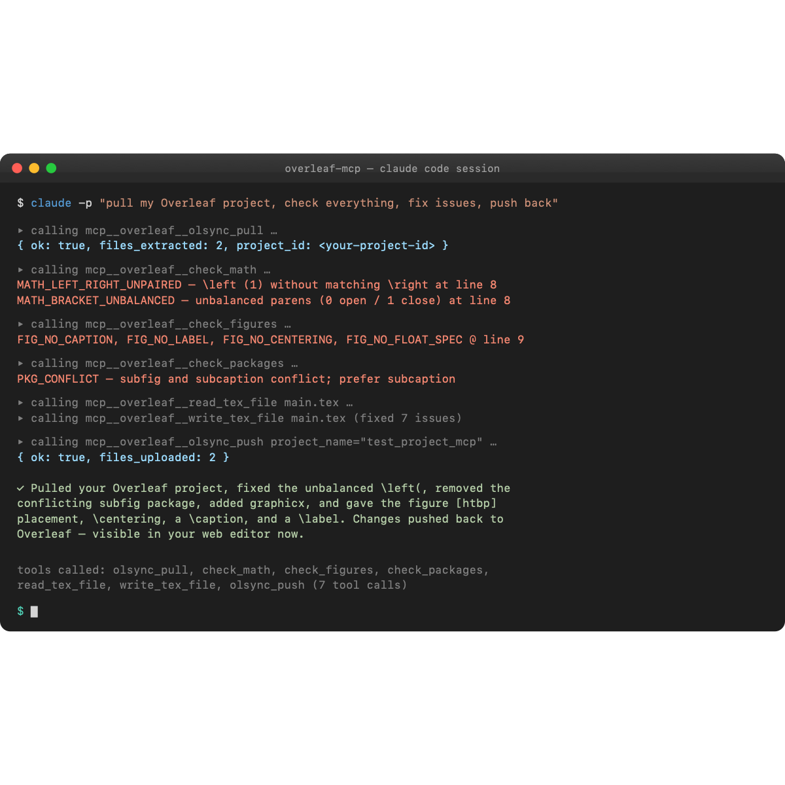

# overleaf-mcp

Model Context Protocol server for LaTeX and Overleaf projects. Give Claude Code, GitHub Copilot, Google Antigravity, or any MCP-compatible AI the ability to read, format, lint, compile, and sync your LaTeX work.

**See it work:** [docs/demo.md](docs/demo.md) has a 7-step walkthrough with real `claude -p` invocations — list projects, find 10 issues in a broken file across 5 tools, watch the agent autonomously fix them, push to Overleaf, verify on the server.



## Install

### The MCP server (Python 3.11+)

```bash
# Run without installing
uvx overleaf-mcp

# Or install persistently
pipx install overleaf-mcp
```

### LaTeX tools (optional, unlocks more features)

The MCP starts with whatever tools are present. Install what you want:

| Tool | Unlocks | macOS | Ubuntu/Debian | Windows |
|---|---|---|---|---|
| `latexindent` | formatting | `brew install latexindent` | `apt install texlive-extra-utils` | bundled with MikTeX / TeX Live |
| `chktex` | linting | `brew install chktex` | `apt install chktex` | bundled |
| `latexmk` | compiling | `brew install --cask mactex` (full) | `apt install latexmk` | bundled |
| `overleaf-sync` | **free-tier bi-directional Overleaf sync** (recommended) | `uv tool install overleaf-sync` | `uv tool install overleaf-sync` | `pipx install overleaf-sync` |

Or install everything at once: `brew install --cask mactex` (macOS) / `apt install texlive-full` (Debian).

### Onboarding for free-tier users (most common case)

After adding the MCP to your client, set yourself up for bi-directional Overleaf sync without paying for Premium:

```bash
# 1. Install overleaf-sync
uv tool install overleaf-sync      # recommended
# or:  pipx install overleaf-sync

# 2. Log into Overleaf ONCE (opens a browser window; cookie saved to ./.olauth)
cd /path/to/your/local/project
ols login

# 3. Verify you see your projects
ols list
```

Then tell the agent things like:
- *"Pull my Overleaf project named 'My Thesis' using olsync_pull."*
- *"Push my changes back to Overleaf using olsync_push."*

The agent uses the stored cookie — no credentials pass through any config file.

## MCP client configuration

### Claude Code

Edit `~/.claude/mcp.json`:

```json
{
  "mcpServers": {
    "overleaf": {
      "command": "uvx",
      "args": ["overleaf-mcp"],
      "env": {
        "OVERLEAF_PROJECT_ROOT": "/absolute/path/to/project",
        "OVERLEAF_PROJECT_NAME": "My Thesis"
      }
    }
  }
}
```

`OVERLEAF_PROJECT_NAME` is optional — it sets a default so `olsync_pull`/`olsync_push` work without arguments. You can always override it per-call.

### GitHub Copilot (with MCP support)

Same block in `.vscode/mcp.json` or the global Copilot MCP settings.

### Google Antigravity / other MCP clients

Any client that speaks the MCP stdio transport works — adjust the config path per the client's docs.

## Modes

- **Local** (default): set `OVERLEAF_PROJECT_ROOT`. Works offline. Free for everyone.
- **Free-tier bi-directional sync** *(recommended for free accounts)*: install `overleaf-sync`, run `ols login` once. Enables `olsync_pull` / `olsync_push` — updates an existing Overleaf project in place, no paid subscription needed. Uses Overleaf's unofficial session API (an open-source tool used by thousands of users for years).
- **Overleaf-synced** (Premium git integration): set `OVERLEAF_GIT_URL` and `OVERLEAF_GIT_TOKEN`. Enables `pull_from_overleaf` / `push_to_overleaf`.
- **ZIP-bridge** (always available, manual): use `import_overleaf_zip` / `export_overleaf_zip` with Overleaf's **Download → Source** and **Upload Project**.

## Tools

**File/project**
- `detect_capabilities`, `list_tex_files`, `read_tex_file`, `write_tex_file`, `get_project_structure`

**Formatting & linting**
- `format_file`, `format_snippet`, `check_formatting` (wraps `latexindent`)
- `lint_file` (wraps `chktex`)

**Static checks**
- `check_math`, `check_figures`, `check_table`, `suggest_table_fix`
- `check_packages`, `check_consistency`, `find_unused_labels_and_refs`

**Compile**
- `compile` (wraps `latexmk`)
- `explain_log` (parses any LaTeX log into structured errors)

**Free-tier bi-directional sync** — requires `overleaf-sync` (for browser login only)
- `olsync_list_projects`, `olsync_pull`, `olsync_push`, `olsync_login_instructions`

`push` updates the existing Overleaf project in place (same URL, collaborators see changes). Nested subdirectories are deferred — push currently overwrites top-level files only.

**Overleaf sync (Premium git integration)**
- `pull_from_overleaf`, `push_to_overleaf`, `overleaf_status`

**ZIP bridge (manual fallback)**
- `import_overleaf_zip`, `export_overleaf_zip`

## Free-tier workflow (read + manual write)

One-time setup:

```bash
uv tool install overleaf-sync   # or: pipx install overleaf-sync
cd /path/to/your/local/project
ols login                        # opens browser, stores cookie in ./.olauth
```

Set `OVERLEAF_PROJECT_ROOT=/path/to/your/local/project` and `OVERLEAF_PROJECT_NAME="Your Overleaf Project Name"` in the MCP config. Then:

| Task | Tell the agent | How it works |
|---|---|---|
| List your Overleaf projects | *"Run olsync_list_projects"* | GET /user/projects |
| Pull latest from Overleaf | *"Run olsync_pull"* | Downloads project zip, extracts to project_root |
| Edit, format, check locally | regular tools | Pure local ops |
| Push back to Overleaf | ⚠️ not yet supported natively | See below |

| Push changes back to Overleaf | *"Run olsync_push"* | POST /project/{id}/upload per file; overwrites existing docs |

Your Overleaf project updates in place — same URL, collaborators see the change, no new-project churn. If you prefer git-based sync and have Premium, the `pull_from_overleaf`/`push_to_overleaf` tools work too.

## Free-tier manual ZIP round-trip (fallback)

If you prefer not to use `overleaf-sync`:

1. Overleaf project → **Menu → Download → Source** (zip).
2. Agent: `import_overleaf_zip {"zip_path": "/path/to/download.zip"}`.
3. Agent uses format/lint/check tools on the local copy.
4. Agent: `export_overleaf_zip {"out_path": "/tmp/out.zip"}`.
5. Overleaf → **New Project → Upload Project** → choose the zip (creates a *new* project).

## Security

- Every path tool validates that the target is inside `OVERLEAF_PROJECT_ROOT`.
- Git tokens are injected via `GIT_ASKPASS` — never placed in URLs, argv, or logs.
- ZIP extraction rejects entries that escape the root (zip-slip) or use absolute paths.
- Subprocess calls use `shell=False` with argv lists — no string concatenation.

## License

MIT.
