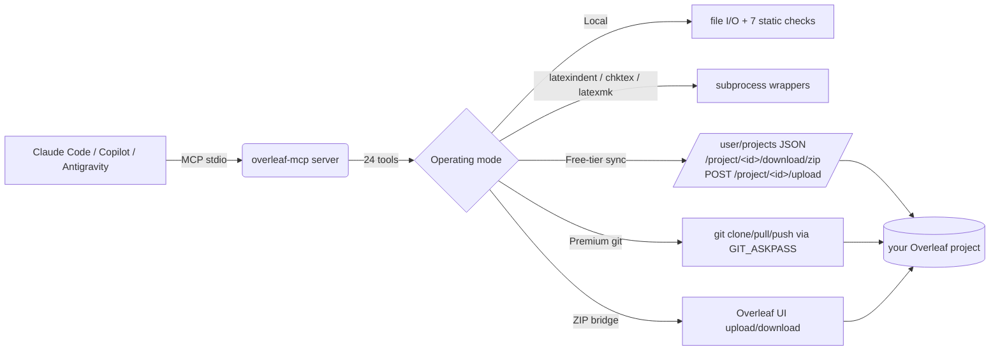

<p align="center">
  
</p>

<p align="center">
  <a href="#install"></a>
  <a href="#tools"></a>
  <a href="#development"></a>
  <a href="#license"></a>
  
</p>

<p align="center">
  <b>Give any MCP-capable AI agent the power to read, lint, fix, compile, and sync your LaTeX work on Overleaf — free tier included.</b>
</p>

---

## What it does

An MCP server you plug into Claude Code (or GitHub Copilot, Google Antigravity, any client that speaks MCP stdio). Once connected, the agent can:

- **Read and write your LaTeX project files** with path-boundary safety.
- **Run 7 static checks** on every `.tex`: math brackets, align-column drift, figure completeness, table column match, package conflicts, heading-case consistency, dangling refs / unused labels / uncited bib.
- **Format with `latexindent`**, lint with `chktex`, compile with `latexmk` — all gracefully degrade if the binary isn't installed.
- **Sync with Overleaf** in three ways: native free-tier pull **and** push (no Premium), the official git integration (Premium), or a manual ZIP round-trip as a last resort.
- **Translate cryptic LaTeX log output** into structured errors with one-line suggestions.

It's the first MCP server that actually lets a free-tier Overleaf user do `pull → edit → push` from an AI agent in a single turn.

---

## Demo

See [docs/demo.md](docs/demo.md) for a full 7-step transcript: list projects → plant 7 deliberate bugs → agent finds 10 findings across 5 checker tools → agent autonomously fixes every one → push back to Overleaf → independently verify on the server. Every query is a real `claude -p` invocation; every output is unedited.

<p align="center">
  
</p>

---

## Table of contents

1. [Quick start](#quick-start)
2. [Install](#install)
3. [Configure your MCP client](#configure-your-mcp-client)
4. [Operating modes](#operating-modes)
5. [Tool reference](#tools)
6. [Example prompts](#example-prompts)
7. [Architecture](#architecture)
8. [Security](#security)
9. [Development](#development)
10. [Roadmap](#roadmap)
11. [License](#license)

---

## Quick start

**60-second setup for Claude Code, free-tier Overleaf account:**

```bash
# 1. Install this MCP server (stdio binary)
uv tool install overleaf-mcp               # or:  pipx install overleaf-mcp

# 2. Install overleaf-sync (used ONLY for the browser login, not for sync)
uv tool install overleaf-sync              # or:  pipx install overleaf-sync

# 3. Log into Overleaf once (opens a browser, stores ./.olauth in the project dir)
mkdir -p ~/tex/my-project && cd ~/tex/my-project
ols login

# 4. Register the MCP in Claude Code
claude mcp add overleaf \
  --env OVERLEAF_PROJECT_ROOT="$HOME/tex/my-project" \
  --env OVERLEAF_PROJECT_NAME="My Real Project" \
  -- overleaf-mcp
```

Now in any Claude Code chat:

> *"Use the overleaf MCP — pull my project, run every check, fix what you can, and push back."*

The agent calls `olsync_pull` → the static checkers → `write_tex_file` with fixes → `olsync_push`. Your Overleaf project updates in place, same URL, collaborators see the change.

---

## Install

### The MCP server itself

| Method | Command |
|---|---|
| **Run without installing** (recommended) | `uvx overleaf-mcp` |
| Install globally with uv | `uv tool install overleaf-mcp` |
| Install globally with pipx | `pipx install overleaf-mcp` |
| From source | `git clone <this-repo> && cd overleaf-mcp && uv sync && uv run overleaf-mcp` |

**Requires Python 3.11+.** No runtime deps beyond the `mcp` SDK, `pydantic`, `requests`, `websockets`, and `overleaf-sync` (for its browser login helper).

### Optional LaTeX tools

Each unlocks a set of MCP tools. Missing ones are reported via `detect_capabilities` and return install hints when called — the server never refuses to start.

| Tool | Unlocks | macOS | Debian / Ubuntu | Windows |
|---|---|---|---|---|
| `latexindent` | `format_file`, `format_snippet`, `check_formatting` | `brew install latexindent` | `apt install texlive-extra-utils` | bundled with MikTeX / TeX Live |
| `chktex` | `lint_file` | `brew install chktex` | `apt install chktex` | bundled |
| `latexmk` | `compile` | `brew install --cask mactex` | `apt install latexmk` | bundled |
| `overleaf-sync` | `olsync_*` (needed **only** for the one-time browser login) | `uv tool install overleaf-sync` | `uv tool install overleaf-sync` | `pipx install overleaf-sync` |

The static checks (`check_math`, `check_figures`, `check_packages`, etc.) are pure Python and work with no external deps.

---

## Configure your MCP client

### Claude Code

Run once on the CLI:

```bash
claude mcp add overleaf \
  --env OVERLEAF_PROJECT_ROOT=/absolute/path/to/project \
  --env OVERLEAF_PROJECT_NAME="My Thesis" \
  -- overleaf-mcp
```

or add to `~/.claude.json` by hand:

```json
{
  "mcpServers": {
    "overleaf": {
      "command": "overleaf-mcp",
      "env": {
        "OVERLEAF_PROJECT_ROOT": "/absolute/path/to/project",
        "OVERLEAF_PROJECT_NAME": "My Thesis"
      }
    }
  }
}
```

Restart Claude Code; `claude mcp list` should show `overleaf: ✓ Connected`.

### Environment variables

| Variable | Required | Purpose |
|---|---|---|
| `OVERLEAF_PROJECT_ROOT` | **yes** | Absolute path to the local LaTeX working copy. |
| `OVERLEAF_PROJECT_NAME` | no | Default project name for `olsync_pull`/`olsync_push`. Overridable per call. |
| `OVERLEAF_OLS_COOKIE` | no | Custom path to the `.olauth` cookie file (default: `$OVERLEAF_PROJECT_ROOT/.olauth`). |
| `OVERLEAF_GIT_URL` | no | Overleaf Premium git URL (e.g. `https://git.overleaf.com/<id>`). Enables the `pull_from_overleaf` / `push_to_overleaf` tools. |
| `OVERLEAF_GIT_TOKEN` | no | Overleaf Premium git token; paired with `OVERLEAF_GIT_URL`. |

### GitHub Copilot (with MCP)

Same JSON block in `.vscode/mcp.json` or the global Copilot MCP settings.

### Google Antigravity / others

Any stdio-MCP client works. Adjust the config location per the client's docs — the `command` / `env` structure is standard.

---

## Operating modes

The server auto-detects which modes are available based on your env vars and installed binaries. Multiple modes can be active simultaneously.

| Mode | When | Enables | How it works |
|---|---|---|---|
| **Local** | always (requires `OVERLEAF_PROJECT_ROOT`) | file I/O + all static checks + format/lint/compile (if binaries present) | pure local operations |
| **Free-tier sync** | `.olauth` cookie present (created by `ols login`) | `olsync_list_projects`, `olsync_pull`, `olsync_push` | downloads zips, uploads via Overleaf's own upload endpoint |
| **Premium git** | `OVERLEAF_GIT_URL` + `OVERLEAF_GIT_TOKEN` | `pull_from_overleaf`, `push_to_overleaf`, `overleaf_status` | standard git over HTTPS with `GIT_ASKPASS` token injection |
| **ZIP bridge** | always | `import_overleaf_zip`, `export_overleaf_zip` | manual round-trip via Overleaf's "Download Source" / "Upload Project" |

---

## Tools

**24 tools in total.** Every tool returns a uniform `{ ok, data?, error?, suggestion? }` result so the agent always gets actionable output.

### File / project awareness

| Tool | Purpose |
|---|---|
| `detect_capabilities` | Report which LaTeX binaries the server found on startup. |
| `list_tex_files` | Enumerate all `.tex` / `.bib` / `.cls` / `.sty` in the project. |
| `read_tex_file` | Read a file; returns content + line count. |
| `write_tex_file` | Atomic write (tmp + rename). Path-boundary enforced. |
| `get_project_structure` | Detect main file, sections, bibliography, `\input` chains, custom classes. |

### Static checks (no external deps)

| Tool | What it catches |
|---|---|
| `check_math` | Unpaired `\left`/`\right`, unbalanced brackets inside math, `&` column drift in `align` / `array` / `matrix`. |
| `check_figures` | Missing `\caption`, `\label`, `\centering`, float placement spec, oversized `\includegraphics` width. |
| `check_table` | Column count mismatch, `\hline` placement. Understands `booktabs` rules. |
| `suggest_table_fix` | Proposes a corrected column spec based on the widest row. |
| `check_packages` | Duplicate `\usepackage`, known-bad combos (`subfig`+`subcaption`, bad `hyperref` order), missing-but-used commands (`\SI` without `siunitx`). |
| `check_consistency` | Cross-file style: heading case uniformity, ASCII vs LaTeX quotes, hyphen vs en-dash in numeric ranges. |
| `find_unused_labels_and_refs` | Dangling `\ref`/`\eqref`/`\cref`, unused `\label`, uncited bib entries. |

### Formatting, linting, compile

| Tool | Requires | Purpose |
|---|---|---|
| `format_file` | `latexindent` | Apply project's `.latexindent.yaml` (or defaults) to a file. |
| `format_snippet` | `latexindent` | Format a string without touching disk. |
| `check_formatting` | `latexindent` | Dry-run; returns a unified diff. |
| `lint_file` | `chktex` | Structured warnings with line, col, code, message. |
| `compile` | `latexmk` | Build the PDF; returns path on success or parsed errors on failure. |
| `explain_log` | — | Pure parser: LaTeX log text → structured errors + suggestions. |

### Free-tier Overleaf sync

| Tool | Purpose |
|---|---|
| `olsync_login_instructions` | Print manual steps to run `ols login` in a fresh terminal. |
| `olsync_list_projects` | `GET /user/projects` — returns all projects (name + id + access level). |
| `olsync_pull` | Download the project zip from `GET /project/{id}/download/zip` and extract into `project_root`. |
| `olsync_push` | Overwrite files in the Overleaf project via `POST /project/{id}/upload` with `name=<filename>` body field. Top-level files only for now. |

### Overleaf Premium git sync

| Tool | Purpose |
|---|---|
| `pull_from_overleaf` | Clone (first call) or `git pull --rebase`. |
| `push_to_overleaf` | `git add -A`, commit, push. Conflicts stop — not auto-resolved. |
| `overleaf_status` | Branch, dirty flag, ahead/behind counts. |

### ZIP bridge (manual)

| Tool | Purpose |
|---|---|
| `import_overleaf_zip` | Unpack a zip from **Menu → Download → Source** into the project root. |
| `export_overleaf_zip` | Zip the project for **New Project → Upload Project**. |

---

## Example prompts

Tested with `claude -p`. Full outputs in [docs/demo.md](docs/demo.md).

**Diagnose an existing project**

> *"Pull my Overleaf project `My Thesis`, then run check_math, check_figures, check_packages, check_consistency, and find_unused_labels_and_refs. Report findings grouped by tool."*

**Autonomous fix loop**

> *"The file main.tex has LaTeX issues. Call the relevant check tools, read the file, write a fixed version that addresses every finding, and tell me in one sentence what you changed."*

**Build a fresh document from Markdown**

> *"Convert the Markdown resume at /path/to/resume.md into a well-formatted single-page LaTeX resume. Write it to main.tex, run all checks until clean, then push to the Overleaf project `resume`."*

**Debug a compile failure**

> *"Compile main.tex. If it fails, explain the errors with explain_log, fix them, and retry until it compiles."*

**Refactor style**

> *"Run check_consistency across the project and fix any heading-case or dash-style findings by rewriting the affected files."*

---

## Architecture



### Key design choices

- **Stateless between tool calls.** Every call re-reads files and re-detects project structure — safe for concurrent agent calls and zero stale-cache bugs.
- **Uniform `ToolResult` envelope.** `{ ok, data?, error?, suggestion? }` — the agent always gets actionable, structured output, even on failure.
- **Graceful capability degrade.** The server boots with whatever binaries are present. Missing-tool calls return install hints, not errors.
- **Native free-tier push.** Reverse-engineered Overleaf's current REST upload endpoint (see commit `41d2782`) so free-tier users get true in-place sync without waiting on upstream fixes to the abandoned `overleaf-sync` websocket client.
- **Pure-Python static checks.** No external lint dependencies — `check_math`, `check_figures`, `check_packages`, etc. work on any machine.

---

## Security

- **Path-boundary enforcement.** Every path argument is resolved and checked against `OVERLEAF_PROJECT_ROOT`. Attempts to escape (`../../etc/passwd`) are rejected before any filesystem access.
- **Atomic writes.** `write_tex_file` writes to a temp file and `os.replace`s into place — a crash mid-write can't leave a half-written `.tex`.
- **Token redaction.** Premium git tokens are injected via `GIT_ASKPASS`, never placed in URLs, argv, or log output. A `redact()` helper sanitizes any stderr before surfacing it.
- **ZIP-slip protection.** `import_overleaf_zip` pre-validates every entry path before writing any files; archives containing `../` or absolute paths are rejected whole.
- **No `shell=True`.** All subprocess calls use argv lists with `shell=False`.
- **Overleaf cookie never transits config.** The `.olauth` cookie is created by `ols login` (interactive browser) and lives on disk at 0600 permissions; the MCP reads it directly.

---

## Development

```bash
git clone <this-repo>
cd overleaf-mcp
uv sync --extra dev
uv run pytest                                 # 81 tests
uv run ruff check .
uv run pytest tests/golden                    # real-world corpus
```

- **Code layout:** `src/overleaf_mcp/` with one module per subsystem (`tools/`, `checks/`, `parse/`, `security/`).
- **Testing philosophy:** Every tool has unit tests; external APIs (Overleaf, subprocess) are mocked at the boundary. A `tests/golden/` corpus of 4 real-world LaTeX projects (article, thesis, beamer, multi-file) is validated against pinned baselines so future changes can't silently regress check accuracy.
- **CI** runs on Python 3.11 and 3.12, plus a separate job that installs TeX Live to exercise the `latexindent`/`chktex`/`latexmk` code paths.

Full dev setup and release process in [CONTRIBUTING.md](CONTRIBUTING.md).

---

## Roadmap

- **`olsync_push` nested folders** — currently overwrites top-level files only; recursive folder creation is the obvious next step.
- **`olsync_delete`** — for removing files from an Overleaf project (the REST endpoint exists; just not wired up).
- **Diff-driven push** — only upload files that actually changed, with a local hash cache.
- **`check_bibliography`** — validate BibTeX syntax, detect duplicate keys across files.
- **`format_project`** — run `latexindent` over every `.tex` in one shot.
- **PyPI release** — the package is structured and tested; first public release is imminent.

---

## License

[MIT](LICENSE) © 2026 Aman Kumar. Free for personal and commercial use.

**This project is not affiliated with, endorsed by, or sponsored by Overleaf Ltd.** It uses Overleaf's public REST endpoints and an authenticated session cookie created by the open-source `overleaf-sync` tool. Your Overleaf account's visibility and access controls are unchanged.
